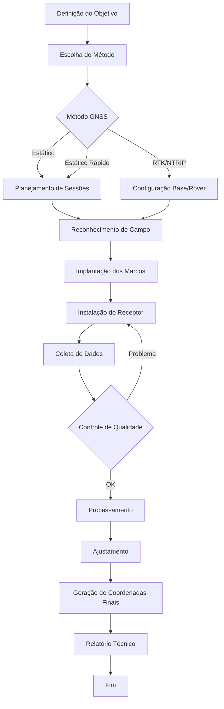

```mermaid
flowchart TD

A[Definição do Objetivo] --> B[Escolha do Método]
B --> C{Método GNSS}

C -->|Estático| D[Planejamento de Sessões]
C -->|Estático Rápido| D
C -->|RTK/NTRIP| E[Configuração Base/Rover]

D --> F[Reconhecimento de Campo]
E --> F

F --> G[Implantação dos Marcos]
G --> H[Instalação do Receptor]
H --> I[Coleta de Dados]

I --> J{Controle de Qualidade}
J -->|OK| K[Processamento]
J -->|Problema| H

K --> L[Ajustamento]
L --> M[Geração de Coordenadas Finais]
M --> N[Relatório Técnico]
N --> O[Fim]
```
