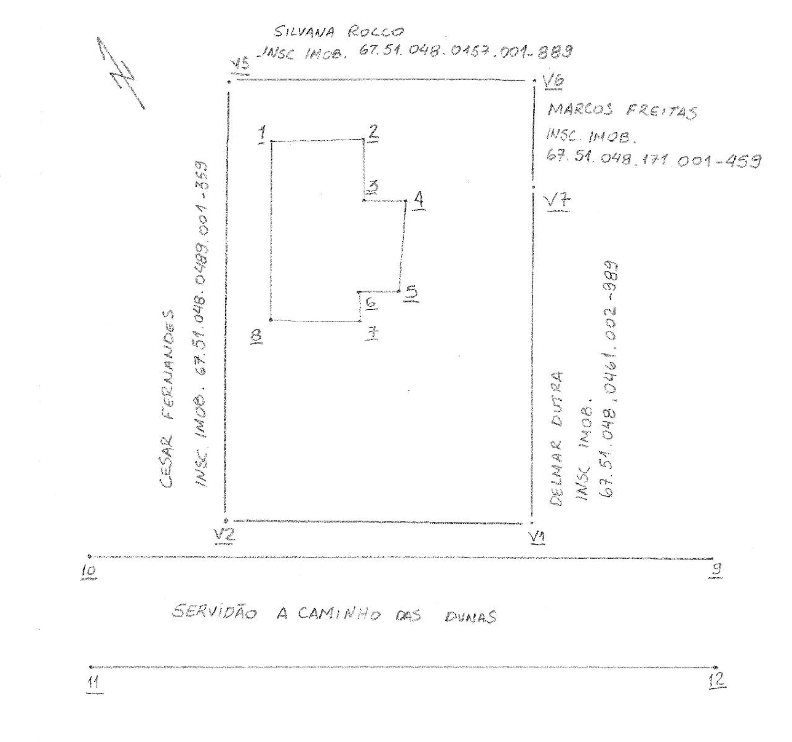

# EXERCÍCIO 1

## Departamento Acadêmico da Construção Civil - DACC

### Curso Técnico em Agrimensura

#### **DESENHO  AUXILIDAO POR COMPUTADOR**

\
**Nome:** \_\_\_\_\_\_\_\_\_\_\_\_\_\_\_\_\_\_\_\_\_\_\_\_\_\_\_\_\_\_\_\_\_\
**Data:**\_\_\_\_/\_\_\_\_/\_\_\_\_\_\_\_

***

#### **EXERCÍCIO 1**

Realizar o desenho topográfico através dos dados e croqui a seguir.

**Passos:**

1. Configurar unidades;
2. Configurar camadas conforme orientação do professor;
3. Configurar texto;
4. Configurar ponto;
5. Aprender a inserir coordenadas retangulares (pontos);
6. Aprender a inserir texto;
7. Aprender a inserir linha e polilinha;
8. Usar ferramenta de precisão (Object Snap);
9. Mover texto.

***

**Coordenadas dos Pontos**

| PONTO | X       | Y       |
| ----- | ------- | ------- |
| 1     | 801,059 | 272,459 |
| 2     | 806,635 | 267,150 |
| 3     | 804,075 | 264,471 |
| 4     | 805,016 | 263,562 |
| 5     | 800,638 | 258,967 |
| 6     | 796,585 | 262,826 |
| 7     | 794,973 | 261,132 |
| 8     | 792,504 | 263,501 |
| 9     | 803,053 | 234,967 |
| 10    | 775,916 | 266,219 |
| 11    | 769,875 | 260,974 |
| 12    | 797,012 | 229,722 |
| V1    | 795,043 | 248,493 |
| V2    | 785,886 | 258,690 |
| V5    | 803,501 | 277,425 |
| V6    | 812,450 | 266,896 |
| V7    | 811,729 | 266,143 |

***

**Camadas (Layers) a serem utilizadas**

_(Configurar conforme orientação do professor)_

## SERVIÇO:  LEVANTAMENTO PLANIMÉTRICO

PROPRIETÁRIO: ANA VITÓRIA&#x20;

CIDADE: RECIFE

LOCAL:  BOA VIAGEM&#x20;

<figure><figcaption></figcaption></figure>

***
